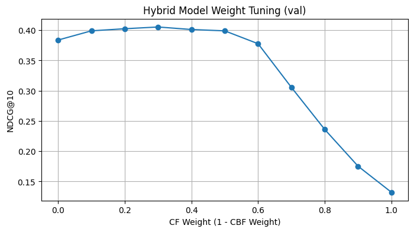
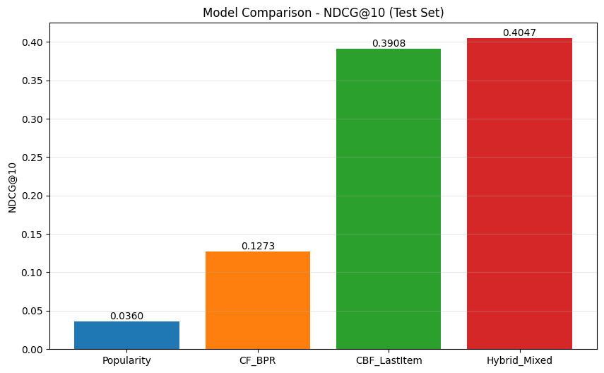
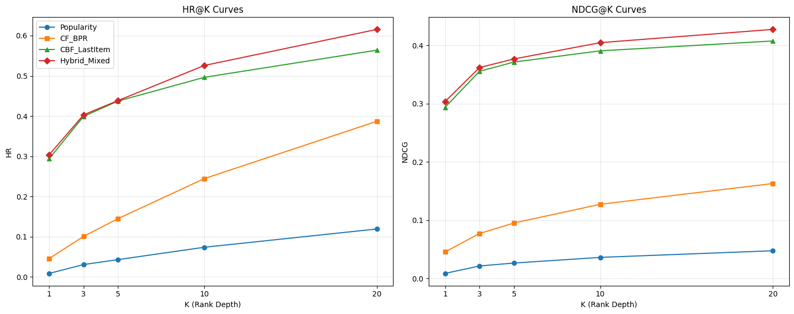

# A Comparative Study of Hybrid, Content-Based, and Collaborative Filtering Recommendation Systems for E-Commerce.

This project conducts a comparative analysis of recommendation strategies using the [RetailRocket](https://www.kaggle.com/datasets/retailrocket/ecommerce-dataset) e-commerce dataset. The study focuses on predicting user purchase behavior by leveraging both behavioral patterns using **Collaborative Filtering** and immediate contextual signals using **Content-Based Filtering**. In the final model, a Hybrid Ensemble strategy is applied, integrating both approaches with a weighted average (70% Content-Based, 30% Collaborative) to explore the strength of a combined strategy.

### Evaluation Protocol
A **Temporal Leave-One-Out** protocol is established to simulate a real-world production environment. For each user, the most recent interaction is reserved for testing, while prior history is used for training.

For evaluation, I adopt a **1-plus-N** strategy, ranking the ground-truth positive item against 100 popularity-sampled negative items. This means data is selected so that it **mixes an actual item the user had purchased with 100 random items they did not purchase. The model then ranks this list of 101 items, and I measure how often the actual purchased item appears near the top.** This approach assesses the model's ability to discriminate relevant items from general noise.

The evaluation protocol is adapted from the research paper: [Multi-Behavior Hypergraph-Enhanced Transformer
for Sequential Recommendation](https://yuyanwei.github.io/papers/chaohuang2022multibehaviorKDD.pdf)

### Data Preparation & Structures

The dataset was filtered to support the Leave-One-Out protocol, which requires a minimum of three distinct **transaction (purchase)** events per user. This threshold is necessary to construct a valid temporal split:

1. **Test Set:** The user's most recent transaction.
2. **Validation Set:** The user's second-most recent transaction.
3. **Training Set:** All remaining historical interactions (views, carts, and earlier purchases) that occurred before the validation transaction.

This ensures that every user in the evaluation has at least one purchase event in the training history to learn from, while maintaining a strict temporal order to prevent data leakage.

**Matrix Construction**:
To support the modeling approaches, two primary data structures are constructed. First, an **Interaction Matrix** is built for the Collaborative Filtering model, representing the strength of user-item relationships. Since the dataset contains implicit feedback, interactions are weighted by their significance: **Views (1.0)** represent mild interest, **Add-to-Carts (3.0)** indicate intent, and **Transactions (10.0)** signal confirmed preference. These weights allow the model to prioritize stronger signals during training. Second, a **Content Matrix** is generated for the Content-Based model using **TF-IDF** vectorization of item properties, which enables the calculation of item-to-item similarity based on descriptive features.

The **experimental cohort** (spanning training, validation, and test sets) retained only the **~980 users** with at least 3 confirmed purchases. While the user cohort is small, it is highly active. I utilized **all interaction types (views, add-to-carts, transactions)** for these users, resulting in **~60k training interactions** (avg. ~60 events/user) across a catalog of **~25k items**. This high-density user history is crucial for the matrix factorization model to learn effective embeddings despite the small sample size.

### Modeling Approaches
Four modeling architectures are evaluated:

1.  **Popularity Baseline**: A non-personalized baseline that ranks items based on their overall popularity (frequency of interactions) in the training set. This serves as a reference point to measure the value of personalization.

2.  **Collaborative Filtering (CF)**: Implements **Implicit BPR (Bayesian Personalized Ranking)** to capture latent user preferences. User preferences are modeled using a weighted implicit feedback matrix, where interaction strength is derived from event types (**View=1, Add-to-Cart=3, Transaction=10**). This matrix factorization technique optimizes the ranking of observed interactions over unobserved ones, assuming users with similar histories share preferences.

3.  **Content-Based Filtering (CBF)**: Utilizes **TF-IDF** vectorization on item properties to predict the next purchase based on the user's immediate past action. By calculating cosine similarity between candidate items and the user's last interacted item, this model captures the semantic continuity of a shopping session.

4.  **Hybrid Ensemble**: Combines both approaches through a weighted ensemble. Since CF (dot product) and CBF (cosine similarity) operate on different scales, raw scores are Min-Max normalized per user before combination. The model blends preference signals from the CF model (weight: 0.3) with the immediate contextual relevance from the CBF model (weight: 0.7). These weights were determined through a grid search on the validation set, which identified the 30/70 split as optimal for maximizing NDCG@10.



_Figure 1. The tuning curve reveals a distinct "sweet spot" at a 30/70 split. While pure Content-Based Filtering (left side, CF=0.0) performs respectably, adding Collaborative Filtering signals improves performance up to the 0.3 threshold. Beyond this point, the performance degrades._

### Metrics Definition
To quantify performance, the following standard information retrieval metrics are used:

*   **HR@k (Hit Rate):** Measures the proportion of test cases where the ground-truth item is present in the top-k recommendations. _Did the correct item appear in the top-k recommendations?_
*   **NDCG@k (Normalized Discounted Cumulative Gain):** A position-sensitive metric that assigns higher scores when the correct item appears near the top of the list. _How high on the list was the correct item?_
*   **MRR (Mean Reciprocal Rank):** The average of the reciprocal ranks ($1/rank$) of the correct item. _On average, how far down does the user have to scroll to find the right item?_

### Findings
Experimental results indicate that immediate context is predictive in this domain. The **Hybrid model** achieves the highest performance, followed closely by the Content-Based approach. The pure Collaborative Filtering model, while effective, performs below the content-focused approaches, suggesting that, for this specific dataset, **immediate intent** is a stronger predictor than **historical preference**.



_Figure 2. The comparison highlights a significant performance gap between behavioral and content-based methods. The Collaborative Filtering model struggles (NDCG@10 ~0.12), likely due to data sparsity or the "cold-start" nature of the test cases. In contrast, Content-Based Filtering performs exceptionally well (NDCG@10 ~0.38), suggesting that users in this cohort exhibit strong semantic consistency in their browsing as they tend to buy items that look like what they just viewed. The Hybrid model successfully bridges these approaches to achieve the top score._

The Hybrid model's superior performance stems from its ability to balance these signals: it relies on Content-Based scores to **capture immediate intent** (predicting the next likely action based on the current session) while using Collaborative Filtering to **incorporate latent preferences derived from historical interaction behavior**.

| Model | Split | HR@5 | NDCG@5 | HR@10 | NDCG@10 | MRR |
|-------|-------|------|--------|-------|---------|-----|
| **Hybrid_Mixed** | val | 0.4547 | 0.3810 | 0.5290 | 0.4050 | 0.3811 |
| **CBF_LastItem** | val | 0.4345 | 0.3652 | 0.4937 | 0.3843 | 0.3631 |
| **CF_BPR** | val | 0.1700 | 0.1095 | 0.2469 | 0.1345 | 0.1226 |
| **Popularity** | val | 0.0315 | 0.0170 | 0.0579 | 0.0256 | 0.0307 |

| Model | Split | HR@5 | NDCG@5 | HR@10 | NDCG@10 | MRR |
|-------|-------|------|--------|-------|---------|-----|
| **Hybrid_Mixed** | test | 0.4386 | 0.3773 | 0.5283 | 0.4060 | 0.3833 |
| **CBF_LastItem** | test | 0.4373 | 0.3720 | 0.4951 | 0.3908 | 0.3716 |
| **CF_BPR** | test | 0.1450 | 0.0935 | 0.2445 | 0.1256 | 0.1132 |
| **Popularity** | test | 0.0418 | 0.0259 | 0.0737 | 0.0360 | 0.0393 |

With an HR@10 of 52.8%, the model identifies the user's next purchase within the top 10 recommendations in half of all test cases. The NDCG@10 of 0.40 confirms that these hits are not just 'making the list' but are consistently ranked highly. Furthermore, an MRR of 0.38 indicates that when the correct item is found, it typically appears in the top 3 positions, making the system effective for limited-space recommendation interfaces.



_Figure 3. The performance curves demonstrate that the Hybrid model's advantage is consistent across all ranking depths. Crucially, the gap is visible even at strict thresholds like K=3 and K=5._

### Statistical Significance (Hybrid vs. CBF)

To verify that the Hybrid model’s improvement over the Content-Based model (CBF_LastItem) is not due to random variation, I ran statistical significance testing on the **test split**.

For each user, I computed per-user HR@10 and NDCG@10 on the same 1-plus-N candidate set (1 positive + 100 popularity-sampled negatives). I then apply a **two-sided paired t-test** on the per-user metric differences (Hybrid − CBF). I also reported the **95% bootstrap confidence intervals** (n=1000) for the mean NDCG@10.

**Bootstrap 95% CI (NDCG@10 mean):**
- Hybrid_Mixed: 0.4061  [CI: 0.3760, 0.4379]
- CBF_LastItem: 0.3901  [CI: 0.3585, 0.4200]

**Paired t-test (Hybrid vs CBF):**
- NDCG@10: t = 3.2088, p = 1.3852e-03
- HR@10:   t = 2.7816, p = 5.5347e-03

Both p-values are < 0.05, indicating the Hybrid model’s improvement over CBF is statistically significant under this offline evaluation protocol. The positive t-statistics indicate the Hybrid model performs better on average across users.

### Project Structure
The codebase is organized to separate data exploration, processing, models and evaluation logic:

```
recommender_systems_private/
├── 01_eda.ipynb                        # Exploratory Data Analysis
├── 02_preprocessing.ipynb              # ETL Pipeline (Cleaning, Splitting, Feature Eng.)
├── 03_models.ipynb                     # Main Training & Evaluation Loop
├── src/
│   ├── cbf.py                          # Logic for the content-based filtering component
│   ├── metrics.py                      # Custom implementations of HR, NDCG, and MRR
│   └── paper_protocol.py               # Implementation of the splitting and sampling logic
├── data/
│   └── processed/                      # The processed artifacts used for modeling
├── requirements.txt                    # Project dependencies
└── readme.md                           # Project documentation
```


